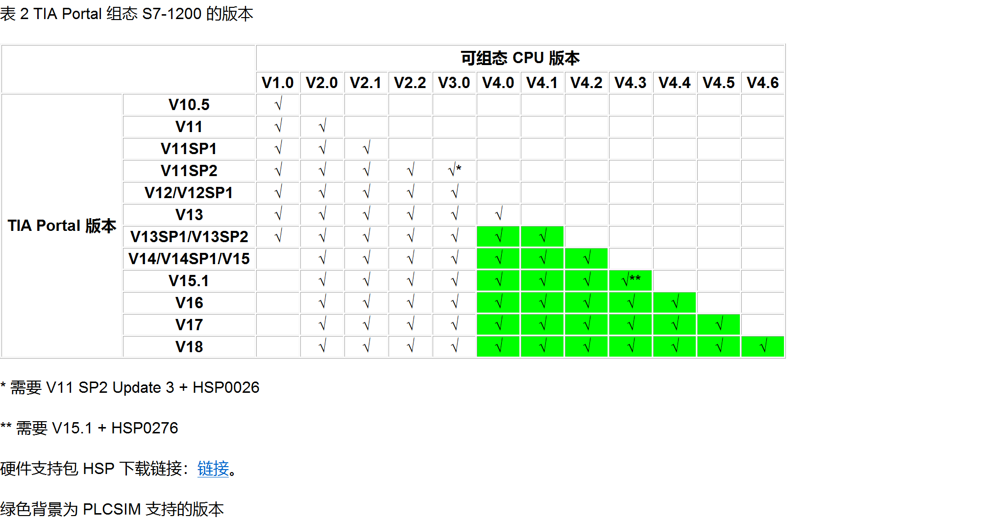

# S7-1200 CPU 固件常见问题

本文档简要 S7-1200 系列 CPU 的固件常见的升降级、组态、兼容性相关问题。

## 什么是固件
CPU 操作系统将各种功能集成在固件之中，如果需要在 CPU 中增加功能，则需要在固件更新包中集成新功能，加载到 CPU ，配合在软件中的 CPU 的版本去实现，此外固件更新包也会修复之前版本中的一些错误。所以对于客户来说，需要操作的是将网上的固件更新包下载下来，加载到 CPU 中，尽可能保证当前 CPU 的固件是当前订货号能够加载的最新固件。

目前的固件版本号形如 x.y.z，其中软件组态只关注 x.y ，第 2 个小数点后面的数字，在软件中无法组态，大多数情况只是修复错误，不影响功能使用，但是有这一位的固件变化也是建议更新。

对于每个产品不同订货号的固件最高版本是不一样的，例如 CPU 1211C DC/DC/DC，订货号 6ES7211-1AD30-0XB0，这个订货号的 CPU 1211 只能通过固件更新到版本 V2.2.0，而订货号为 6ES7211-1AE40-0XB0 的 CPU 1211，目前是可以升级到当前最新的 V4.5.1，具体订货号能升级到的最高版本请参见[固件下载链接]()中网页的描述。

在软件层面，不同版本的 TIA Portal 软件支持的 CPU 最高版本不同，具体参见表 2。需要确保 CPU 中实际固件版本要 ≥ 软件中组态的版本，例如使用 TIA PORTAL V16 ，软件能够组态的最高固件版本是 V4.4，如果使用的 CPU 固件版本是 V4.5，这样是可以正常使用的。但是如果使用 TIA Portal V17， 组态 CPU 固件版本 V4.5，但实际 CPU 固件版本是 V4.4，这种情况是不能够装载组态的。

对于已经进行过固件升级的 CPU 理论上是也能再通过固件更新的方法降级回去，但是一般不建议，毕竟升级后的固件即使会报错，没有必要再降级回去的。如果从出厂版本再往下降，一般情况下是不能降级的不使用新功能，也是修复了错误，即使软件组态不了较新版本，也是可以正常使用不。

## 固件更新
固件更新方法的说明参见表

|固件更新方式 | 使用限制 | 链接 |
|------------|----------|-----|
|通过SIMATIC存储卡| 无限制 |[链接]()|
|通过“在线与诊断”或通过可访问的设备 |CPU V4.0及以上版本 | [链接]() |
|通过集成的Web服务器 |CPU V3.0及以上版本 |[链接]()|
|通过SIMATIC Automation Tool | CPU V4.0及以上版本| [链接]()|

固件包的下载链接：[链接]()。

## 固件更新注意事项：
- S7-1200 CPU 可以将固件从 V1.x 升级为 V2.x 。但是不能将固件从 V2.x 升级为 V3.x，也不能将固件从 V3.x 升级为 V4.x。
- V1.x/V2.x、V3.x、V4.x 的 CPU 是不同系列的订货号。

## TIA Portal 组态

注意：除了上面列出的两个通过安装 HSP 支持更新版本的固件，其余都无法通过加载诸如 HSP、GSD 的方式使得低版本软件组态高版本 CPU，如果想使用高版本 CPU 的功能，必须更换软件。

## 固件兼容性

- 新订货号替代旧订货号

新订货号的 S7-1200 CPU 不能完全替代旧订货号的 CPU； 新订货号的 S7-1200 CPU 会在性能上有所改进；在更换订货号时，需要重新组态、下载新 CPU 的订货号。例如：将S7-1200 V3更换为S7-1200 V4 的注意事项

- 组态版本兼容性

S7-1200 CPU V4.x 版本， 实际固件高版本可以兼容组态的低版本，可以在 TIA Portal 上组态 CPU 低于实际版本，但是无法使用新的固件功能.

例如：CPU 版本 V4.5，根据表 2 可知使用 TIA Portal V16 最高只能组态 V4.4，将该组态下载可以正常运行。如果是新 CPU 第一次使用这样组态， CPU 会报错，可以尝试进行恢复出厂设置，方法链接，然后重新下载硬件组态，问题就会得到解决。

- 固件降级

S7-1200 CPU V4.x 版本， 从高版本降级到低版本时可能会存在硬件版本的限制，例如：6ES7215-1xx40-0XB0 FS:06 ，最低固件版本只能到 V4.2.0。

